## Task 1
```While playing the game, choose three performance issues that you noticed or suspect.```

## Task 2

First issue: ```Here is a short video showing an in-game issue: Game Issue```

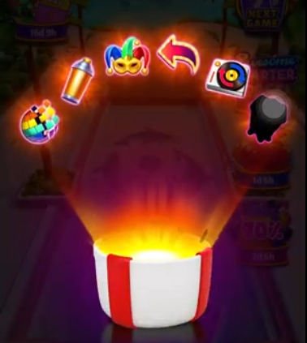

The first issue shows UI icons turning black instead of colorful (if I understood the issue right). The problem is with rendering, not with logic. So it's shader error, material error or lighting error. 
* If it's a shader error, we have to check the shader. It might use some special keywords like _GLOW, _BLENDMODE_ADD, _EMISSION_ON. If so, check if those keywords are enabled at runtime correctly. Project Settings -> Graphics -> Shader Stripping -> Disable Unused Variants. Then, we may want to warm up variants using ShaderVariantsCollection or Addressables preload.
* Theoretically it can be a lit shader on Screen-space UI. Screen-space UI does not have lighting and lit material renders as it would without any lights, so it's black. If so, change the shader to unlit, the one that does not use lighting.
* Also we have to check the render queue of the material. It must be after the opaque materials have rendered already, so Render Queue must be Transparent, and the shader must blend colors using Blend SrcAlpha OneMinusSrcAlpha.


Second issue: ```Here is another short video showing an in-game issue: Game Issue```

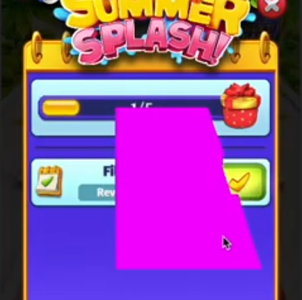

This issue shows the pink overlay on top of the water. We can see that the pink artefacts are actually rect-shaped, meaning those are particles that don't have their material (so it's pink). 
* So the problem is clearly with particles that are supposed to be on top of a water. This time I'd say that the material is not loaded (may be the material is not included in an asset bundle). If so, we just need to ensure that the material is correct and available at runtime for the device we test it on. 
* May be also the shader is broken, so it does not compile. This way we have to check a console for error - shader compilation errors must be there. Also we can use Frame Debugger for help.

## Task 3
```Build a small hub scene that streams two puzzle-themed sub-scenes additively using Addressables, triggered by proximity via a simple grid-based controller. Keep visuals minimal; we care about correctness, clarity, and a clean lifecycle.```

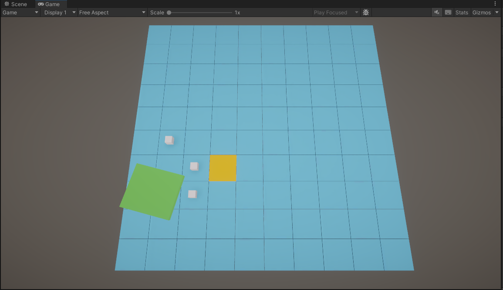

* Open the Hub scene

  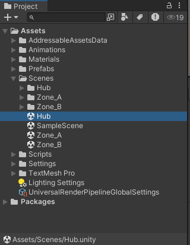

* Press Play
  
  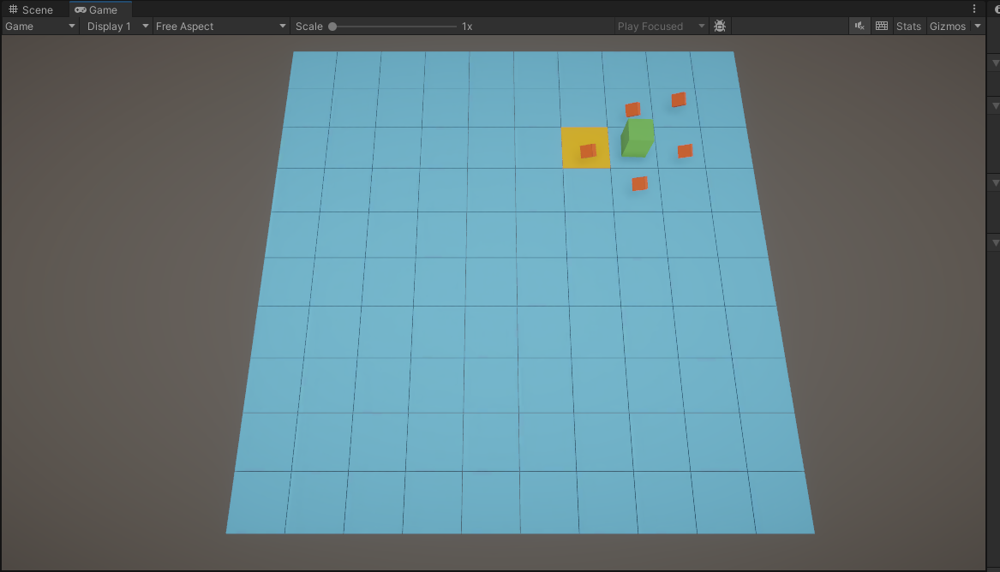

* Yellow square represents a cursor. Use WASD keys to move it thorugh the grid

  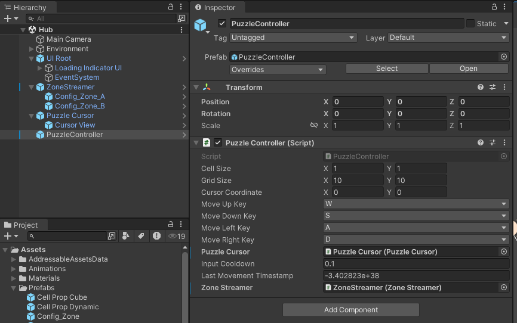

* Upon approaching loading distance, zones will be loaded and streamed. There are two zones: Zone_A and Zone_B with corresponding scene each. To setup zones, open the Hub scene in Unity Editor and set values on ```ZoneConfigurationAuthoring``` component. 

  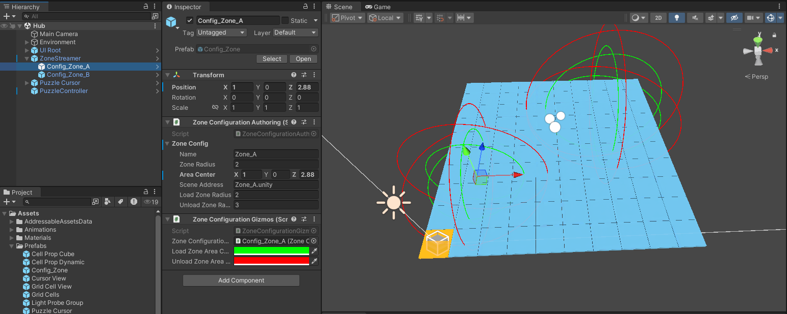

* Puzzle Grid (or game field) is a 100 static cubes each indicating it's own cell. 

  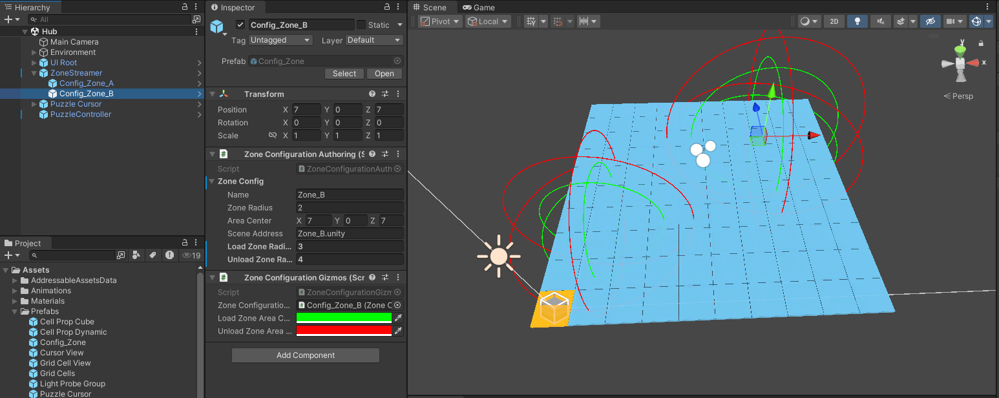

* Yellow cube represents a cursor the User can move with WASD keys, and the distance to which determines which zones must be loaded and which must be unloaded.

  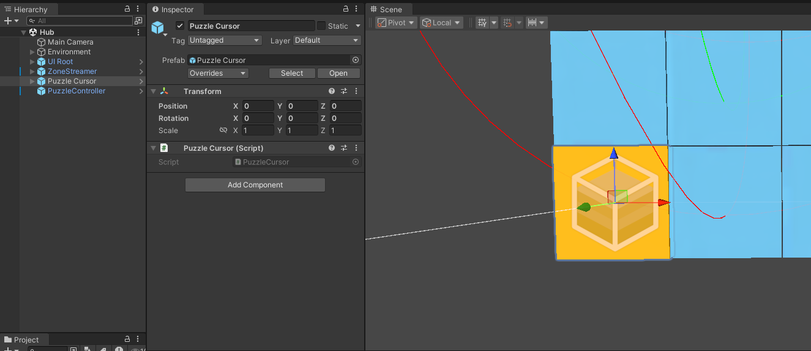

* ZoneStreamer component knows where which zone is and controls zones loading/unloading based on distance from the zone center to the cursor and each zone configuration.

  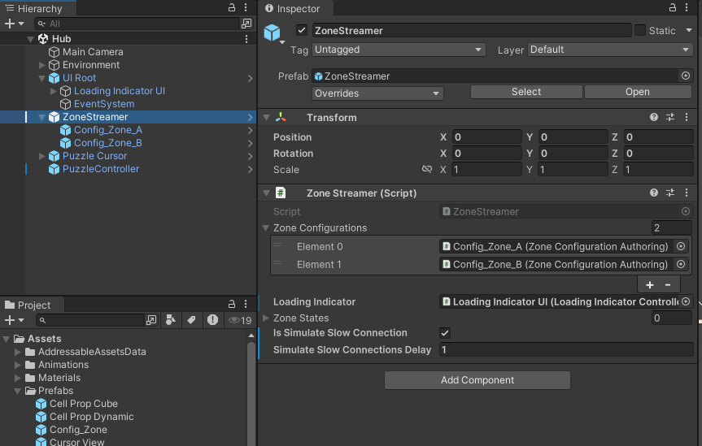

* Configure zones in editor on Hub scene (no need to open Zone_A or Zone_B scene for that)

  

* Commented code for easy understanding what's going on there

  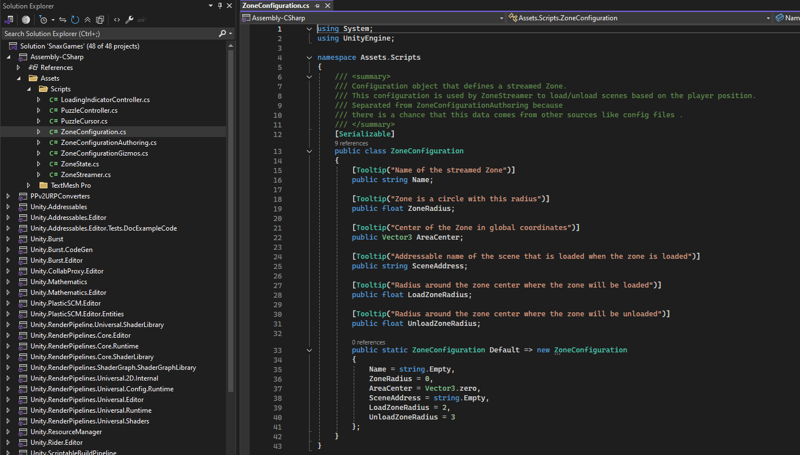

  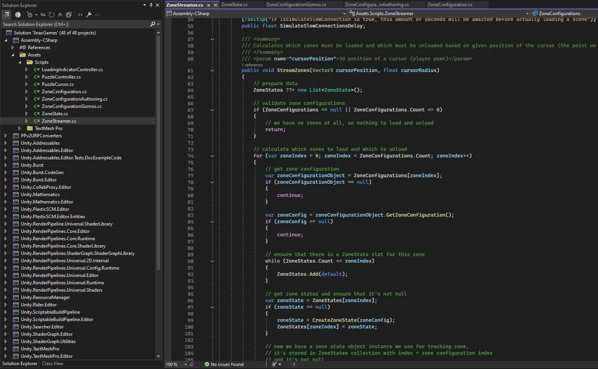
